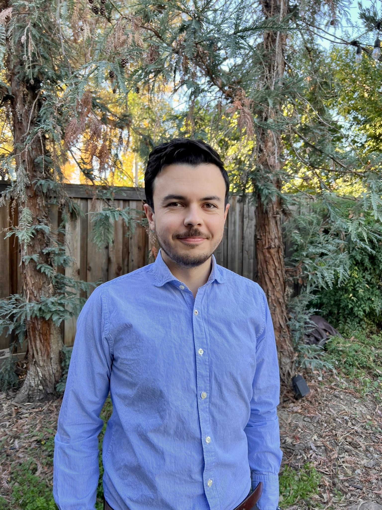

PhD Candidate  
Agricultural and Resource Economics  
University of California, Davis

I am a fifth-year PhD student in the Agricultural and Resource Economics department at the University of California, Davis. I study development economics, and my research focuses on agricultural land and labor markets, agricultural productivity, migration, and on how rural households mitigate risk.

Before starting my Ph.D. I received an MA and a BA in Economics from the Universidad de los Andes.

